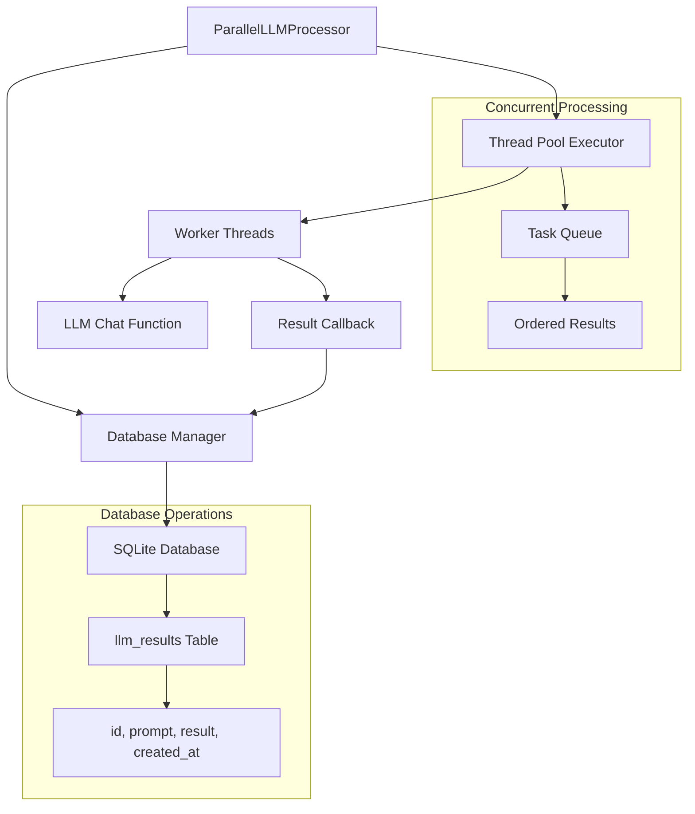

# Design Document

## Overview

本设计为ParallelLLMProcessor类添加可选的SQLite数据库存储功能，在保持原有并发处理性能的同时，提供实时的数据持久化能力。设计采用非侵入式方法，确保现有功能不受影响，同时为用户提供灵活的数据库配置选项。

## Architecture

### 核心设计原则

1. **非侵入性**: 数据库功能作为可选特性，不影响现有的并发处理逻辑
2. **线程安全**: 确保多线程环境下的数据库操作安全性
3. **性能优先**: 数据库操作不应显著影响LLM推理的并发性能
4. **错误隔离**: 数据库错误不应中断主要的推理处理流程

### 系统架构图



## Components and Interfaces

### 1. DatabaseManager类

负责所有数据库相关操作的独立组件：

```python
class DatabaseManager:
    def __init__(self, db_filename: str)
    def initialize_database(self, prompts: List[str]) -> bool
    def update_result(self, prompt_index: int, result: str) -> bool
    def close_connection(self) -> None
```

**职责:**
- 数据库连接管理
- 表结构创建和验证
- 批量初始化prompt记录
- 线程安全的结果更新
- 错误处理和日志记录

### 2. 修改后的ParallelLLMProcessor类

在现有类基础上添加数据库相关参数和逻辑：

```python
class ParallelLLMProcessor:
    def __init__(self, 
                 chat_fn: Callable[[str], str], 
                 num_workers: int = 4,
                 retry_attempts: int = 3, 
                 retry_delay: float = 1.0,
                 timeout: float = 60.0,
                 save_to_db: bool = False,
                 db_filename: Optional[str] = None)
```

**新增功能:**
- 可选的数据库管理器初始化
- 在处理开始前批量插入prompt记录
- 在每个结果完成后实时更新数据库
- 优雅的数据库连接关闭

### 3. 线程安全的数据库操作

使用连接池和锁机制确保并发安全：

```python
import threading
from contextlib import contextmanager

class ThreadSafeDatabaseManager:
    def __init__(self):
        self._lock = threading.Lock()
        self._connection = None
    
    @contextmanager
    def get_connection(self):
        with self._lock:
            yield self._connection
```

## Data Models

### 数据库表结构

**表名**: `llm_results`

| 列名 | 类型 | 约束 | 描述 |
|------|------|------|------|
| id | INTEGER | PRIMARY KEY | 对应prompt列表索引+1 |
| prompt | TEXT | NOT NULL | 输入的提示词 |
| result | TEXT | NULL | LLM推理结果，初始为NULL |
| created_at | TIMESTAMP | DEFAULT CURRENT_TIMESTAMP | 记录创建时间 |

### 数据流程

1. **初始化阶段**: 批量插入所有prompt记录，result字段为NULL
2. **处理阶段**: 并发执行LLM推理
3. **更新阶段**: 每个推理完成后，根据原始索引更新对应记录的result字段

## Error Handling

### 数据库错误处理策略

1. **连接失败**: 记录警告日志，继续执行推理处理，跳过数据库操作
2. **表创建失败**: 记录错误日志，禁用数据库功能
3. **插入/更新失败**: 记录错误详情，不中断主流程
4. **并发冲突**: 使用重试机制，最多重试3次

### 错误日志格式

```python
import logging

logger = logging.getLogger(__name__)

# 示例错误处理
try:
    self.db_manager.update_result(index, result)
except Exception as e:
    logger.error(f"Database update failed for prompt {index}: {str(e)}")
    # 继续处理，不抛出异常
```

## Testing Strategy

### 单元测试

1. **DatabaseManager测试**
   - 数据库连接和表创建
   - 批量插入prompt记录
   - 并发更新操作
   - 错误处理机制

2. **ParallelLLMProcessor集成测试**
   - 启用/禁用数据库功能
   - 并发处理与数据库更新的协调
   - 错误场景下的行为验证

### 性能测试

1. **基准测试**: 对比启用/禁用数据库功能时的处理性能
2. **并发测试**: 验证多线程环境下的数据库操作安全性
3. **压力测试**: 大量prompt处理时的数据库性能表现

### 测试用例设计

```python
def test_database_functionality():
    # 测试数据库基本功能
    
def test_concurrent_updates():
    # 测试并发更新的正确性
    
def test_error_resilience():
    # 测试错误处理的鲁棒性
    
def test_performance_impact():
    # 测试性能影响
```

## Implementation Details

### 默认文件名生成

```python
import time

def generate_default_filename() -> str:
    timestamp = int(time.time())
    return f"llm_results_{timestamp}.db"
```

### 线程安全的SQLite操作

SQLite在Python中默认支持线程安全，但需要注意：
- 使用`check_same_thread=False`参数
- 每个线程操作使用独立的cursor
- 关键操作使用事务保护

### 批量初始化优化

```python
def initialize_prompts_batch(self, prompts: List[str]) -> bool:
    try:
        with self.get_connection() as conn:
            cursor = conn.cursor()
            data = [(i+1, prompt) for i, prompt in enumerate(prompts)]
            cursor.executemany(
                "INSERT INTO llm_results (id, prompt) VALUES (?, ?)", 
                data
            )
            conn.commit()
            return True
    except Exception as e:
        logger.error(f"Batch initialization failed: {e}")
        return False
```

### 内存和资源管理

- 使用上下文管理器确保数据库连接正确关闭
- 在类的`__del__`方法中添加清理逻辑
- 提供显式的`close()`方法供用户调用